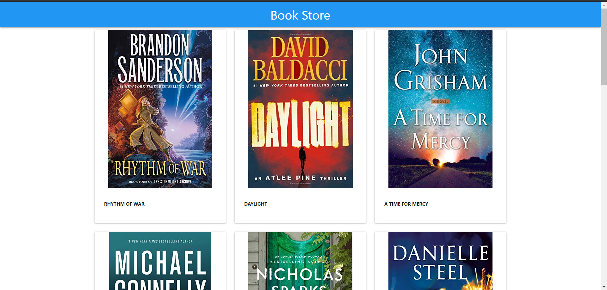
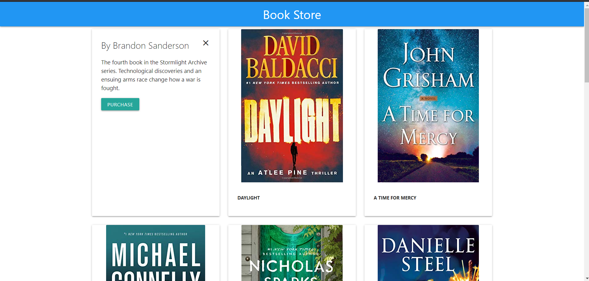

# Demo of the app

https://opshanka.github.io/book-store

# To run the app locally

1. First clone the repo
2. Navigate to the project folder
3. Run `npm install `
4. To run the app run `npm start `

# Screenshots

    

    

